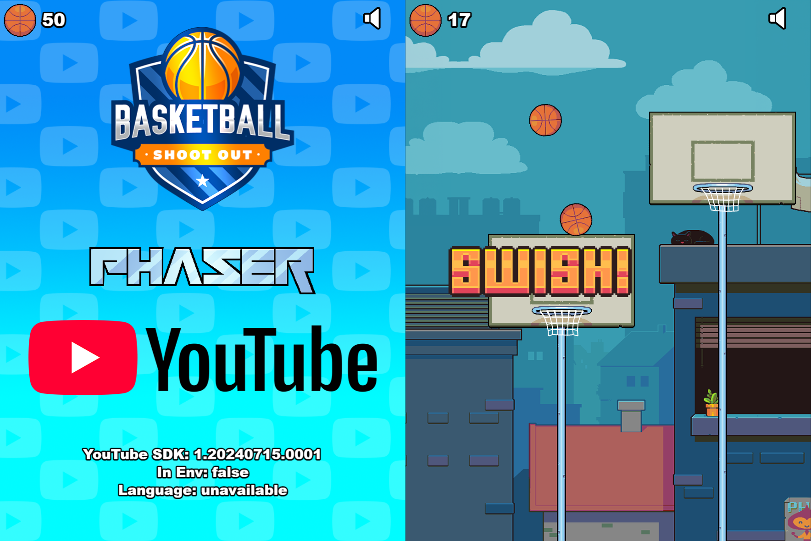

# Phaser YouTube Playables Template

This is a Phaser 3 project template for creating YouTube Playables that uses Vite for bundling. It supports hot-reloading for quick development workflow and includes scripts to generate production-ready builds.

You will find a comprehensive sample game called **Basketball Shoot Out** in this template. This game demonstrates every available feature of the YouTube Playables SDK and is explained in detail below. To test the game, install the dependencies and `npm run dev` then visit `http://localhost:8080` in your browser. We recommend putting the game into Mobile View mode and picking the iPad Pro for the dimensions. It will work at any scale, but this is the size it was built for and gameplay has been tweaked specifically for it.

### Versions

This template has been updated for:

- [Phaser 3.86.0](https://github.com/phaserjs/phaser)
- [YouTube Playables API v1](https://developers.google.com/youtube/gaming/playables/reference/sdk)
- [Vite 5.4.8](https://github.com/vitejs/vite)



## Requirements

[Node.js](https://nodejs.org) is required to install dependencies and run scripts via `npm`.

## Available Commands

| Command | Description |
|---------|-------------|
| `npm install` | Install project dependencies |
| `npm run dev` | Launch a development web server |
| `npm run build` | Create a production build in the `dist` folder |

## YouTube Playables SDK

You can access the SDK documentation at https://developers.google.com/youtube/gaming/playables/reference/sdk which is also where you will find the Test Suite, from which you can check all of the SDK calls being made from your game.

## Getting Started

After cloning the repo, run `npm install` from your project directory. Then, you can start the local development server by running `npm run dev`.

The local development server runs on `http://localhost:8080` by default. Please see the Vite documentation if you wish to change this, or add SSL support.

Once the server is running you can edit any of the files in the `src` folder. Vite will automatically recompile your code and then reload the browser.

To run your game in the YouTube SDK Test Suite, go to https://developers.google.com/youtube/gaming/playables/test_suite and enter `http://localhost:8080` as the Game URL.

## Template Project Structure

We have provided a comprehensive sample game to get you started. This is as follows:

- `index.html` - A basic HTML page to contain the game.
- `src` - Contains the game source code.
- `src/main.js` - The main entry point. This contains the game configuration and starts the game.
- `src/YouTubePlayables.js` - This is our optional YouTube Playables Helper Library.
- `src/scenes/` - The Phaser Scenes are in this folder.
- `src/gameobjects/` - The Phaser Game Objects are in this folder.
- `public/style.css` - Some simple CSS rules to help with page layout.
- `public/assets` - Contains the static assets used by the game.

## YouTube Playables Helper Library

We have included `YouTubePlayables.js` which is our helper wrapper for the Playables v1 SDK. Although the SDK is nice and easy to use, we found there were some common things we had to repeat doing, such as UTF-16 string checks, or parsing JSON after a loadData call. So, we created this open-source wrapper to help you get up to speed quickly. You can see it used through-out our sample game, but we have also included all of the native SDK calls too, so you can swap between them as needed.

### Game Boot

Calling `YouTubePlayables.boot` will wait until the document has loaded _and_ the YouTube Playables SDK is ready before calling the provided callback function:

```js
YouTubePlayables.boot(() => {
    new Phaser.Game(config);
});
```

In the `Boot.js` Scene file, we get our stored game data from YouTube Playables and then set-up the global `onPause` and `onResume` handlers:

```js
async create ()
{
    //  This will load our saved cloud data from the Playables API.

    //  We use the withTimeout wrapper to ensure that the loadData call doesn't hang indefinitely
    //  (which can happen often in the Test Suite if you're using a hot-reloaded setup)

    try
    {
        const data = await YouTubePlayables.withTimeout(YouTubePlayables.loadData(), 1000);

        //  You can also call: ytgame.game.loadData()

        console.log('loadData() result', data);
    }
    catch (error)
    {
        console.error(error);
    }

    //  We are now going to define our game pause and resume handlers.
    //  This is going to pause the entire Phaser game when the YouTube Playables API tells us to.

    // You can also call ytgame.system.onPause(callback);

    YouTubePlayables.setOnPause(() => {

        console.log('YouTube Playables API has requested game pause');

        this.game.pause();

    });

    // You can also call ytgame.system.onResume(callback);

    YouTubePlayables.setOnResume(() => {

        console.log('YouTube Playables API has requested game resume');

        this.game.resume();

    });
}
```

### Preloader

After Boot, we move to `Preloader.js` which loads all of our game assets. In here, we notify YouTube Playables that we are 'first frame ready':

```js
init ()
{
    //  Now we have displayed all of our loader graphics, we need to tell the YouTube Playables API that we are first-frame ready:
    YouTubePlayables.firstFrameReady();

    //  You can also do this by calling:
    // ytgame?.game.firstFrameReady();
}
```

### Main Menu

When the loading completes, we invoke the `MainMenu.js` Scene. In the `create` method, after making our game logos and buttons, we tell YouTube Playables we're now waiting for the user to interact with our game:

```js
create ()
{
    //  Our game is now ready to be interacted with,
    //  so we have to notify the YouTube Playables API about this:
    YouTubePlayables.gameReady();

    //  You can also do this by calling:
    // ytgame?.game.gameReady();
}
```

You can also query the API to know which language the user has set in YouTube and localise your game accordingly:

```js
const language = await YouTubePlayables.loadLanguage();

//  You can also do this by calling:
//  ytgame?.system.getLanguage();
```

### Audio

Your game should also query the YouTube Playables SDK to know if it should play audio, or not:

```js
//  If audio is enabled in the YouTube Player then enable it our game too.
//  You can also call: ytgame.system.isAudioEnabled()

if (YouTubePlayables.isAudioEnabled())
{
    this.enableAudio();
}
else
{
    this.disableAudio();
}

//  We will also respond to the YouTube Player muting / unmuting the audio.
//  You can also call: ytgame.system.onAudioEnabledChange(callback)

YouTubePlayables.setAudioChangeCallback((enabled) => {

    if (enabled)
    {
        this.enableAudio();
    }
    else
    {
        this.disableAudio();
    }

});
```

You can globally mute and unmute all audio in Phaser by simply doing this:

```js
enableAudio ()
{
    this.sound.setMute(false);
}

disableAudio ()
{
    this.sound.setMute(true);
}
```

### Save Score and Save Data

After the Game has played, in the `GameOver.js` Scene, we send our final score to YouTube Playables:

```js
//  Send the score to YouTube
YouTubePlayables.sendScore(this.registry.get('score'));

//  you can also do:
// ytgame?.engagement.sendScore({ value: this.registry.get('score') });
```

We also save our game data, too. This can be any shallow well-formed JS object:

```js
const gameData = {
    // game data goes here
};

//  Save the data to YouTube
YouTubePlayables.saveData(gameData);

//  you can also do:
// ytgame?.game.saveData(string);
```

If using the SDK directly, please note you need to format your data as a valid UTF-16 string with no lone surrogates. Our wrapper will perform these checks for you, but you can use the code in our 'saveData' function to do the same thing, if you'd rather use the SDK directly.

## Handling Assets

Vite supports loading assets via JavaScript module `import` statements.

This template provides support for both embedding assets and also loading them from a static folder. To embed an asset, you can import it at the top of the JavaScript file you are using it in:

```js
import logoImg from './assets/logo.png'
```

To load static files such as audio files, videos, etc place them into the `public/assets` folder. Then you can use this path in the Loader calls within Phaser:

```js
preload ()
{
    //  This is an example of an imported bundled image.
    //  Remember to import it at the top of this file
    this.load.image('logo', logoImg);

    //  This is an example of loading a static image
    //  from the public/assets folder:
    this.load.image('background', 'assets/bg.png');
}
```

When you issue the `npm run build` command, all static assets are automatically copied to the `dist/assets` folder.

## Deploying to Production

After you run the `npm run build` command, your code will be built into a single bundle and saved to the `dist` folder, along with any other assets your project imported, or stored in the public assets folder.

In order to deploy your game, you will need to upload *all* of the contents of the `dist` folder to a public facing web server.

## Customizing the Template

### Vite

If you want to customize your build, such as adding a plugin (i.e. for loading CSS or fonts), you can modify the `vite/config.*.mjs` file for cross-project changes, or you can modify and/or create new configuration files and target them in specific npm tasks inside of `package.json`. Please see the [Vite documentation](https://vitejs.dev/) for more information.

## Join the Phaser Community!

We love to see what developers like you create with Phaser! It really motivates us to keep improving. So please join our community and show-off your work 😄

**Visit:** The [Phaser website](https://phaser.io) and follow on [Phaser Twitter](https://twitter.com/phaser_)<br />
**Play:** Some of the amazing games [#madewithphaser](https://twitter.com/search?q=%23madewithphaser&src=typed_query&f=live)<br />
**Learn:** [API Docs](https://newdocs.phaser.io), [Support Forum](https://phaser.discourse.group/) and [StackOverflow](https://stackoverflow.com/questions/tagged/phaser-framework)<br />
**Discord:** Join us on [Discord](https://discord.gg/phaser)<br />
**Code:** 5000+ [Examples](https://phaser.io/examples)<br />
**Read:** The [Phaser World](https://phaser.world) Newsletter<br />

Created by [Phaser Studio](mailto:support@phaser.io). Powered by coffee, anime, pixels and love.

The Phaser logo and characters are &copy; 2011 - 2024 Phaser Studio Inc.

All rights reserved.
